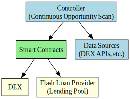

# Strategy

## Overview

The strategy is defined as triangular arbitrage. The Controller continuously scans for arbitrage opportunities using data sources such as the PancakeSwap v3 API to fetch token prices and other relevant information. When a profitable trade is identified, it triggers the smart contract defined in FlashLoanArbitrage.sol to execute the trade. The smart contract interacts with the AAVE Flash Loan Provider to borrow funds and the PancakeSwap v3 DEX to swap Token A for Token B and then Token B for Token C, and finally back to Token A. The smart contract ensures that the flash loan is repaid within the same transaction and retains the profit after covering the loan and transaction fees.

## Components

### Controller

* The Controller is responsible for scanning PancakeSwap v3 for arbitrage opportunities.
* It interacts with the Binance Smart Chain (BSC) using an RPC endpoint provider. Through wss and REST APIs, it fetches real-time data such as token prices, liquidity, and trade information.
* It triggers the smart contract to execute the trade when a profitable opportunity is identified.
* The Controller is deployed on a server to run continuously.

#### Identify Arbitrage Opportunities

The Controller continuously scans for profitable arbitrage opportunities by analyzing trades, token prices and liquidity across trading pairs on PancakeSwap v3. The process involves the following steps:

1. **Pick Tokens A and B**:
   1. Use a RPC provider's wss endpoint to collect real-time trade data from PancakeSwap v3.
   1. In order to find token pair A/B candidates where a price discrepancy is probable, whenever a large trade is detected, calculate the price impact of the tradein bps.
      * `Price Impact = (Price After - Price Before) / Price Before * 10,000`
   1. If the price impact is significant, pick the token pair as a potential arbitrage opportunity's tokens A and B.

1. **Pick Token C**:
   1. For each pool with a token pair containing token B, verify that the C token participates in a pair with token A.
   1. Calculate all the expected profit possibilities from the arbitrage opportunities involving tokens A, B, and Cs.
      * Consider transaction fees, slippage, and other factors to determine the net profit.
   1. Pick the tokens C & A pool that maximizes the expected profit, if any.

1. **Trigger Execution**:
   * If a profitable opportunity is identified, the Controller calls the smart contract to execute the trade atomically.

### FlashLoanArbitrage.sol

* It uses PancakeSwap v3 as the DEX, and the AAVE flash loan provider to borrow funds.
* The smart contract is deployed on the Binance Smart Chain (BSC).
* Profit is retained by the smart contract after repaying the flash loan.
* The transaction fails if the profit is not sufficient to cover the flash loan and transaction fees.

### DEX

* PancakeSwap v3 is the DEX of choice for this system. It has substantial liquidity and trading volume, making it a good platform for arbitrage opportunities.
* PancakeSwap v3 is deployed on the Binance Smart Chain (BSC), which offers low transaction fees and fast confirmation times.
* The structured liquidity distribution in **bin pools** offers more consistent liquidity across price ranges. This consistency can facilitate smoother execution of arbitrage trades, reducing the risk of slippage and enhancing the strategy’s effectiveness.

### AAVE Flash Loan Provider

* AAVE is used as the flash loan provider for this system.
* Flash loans allow borrowing funds without collateral, provided the loan is repaid within the same transaction.
* AAVE charges a fee for flash loans, which is deducted from the profit generated by the arbitrage trade.
